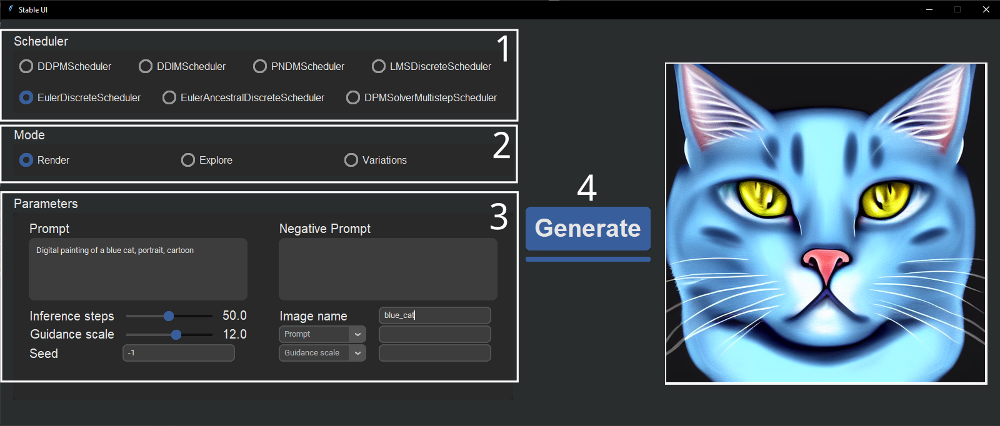
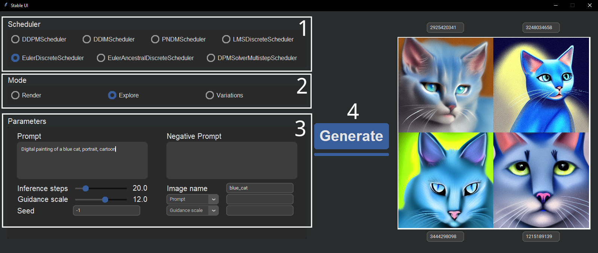
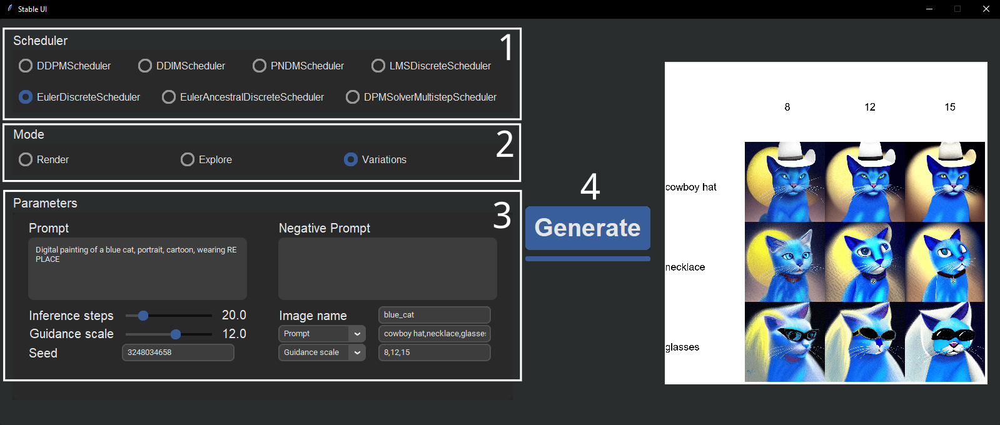
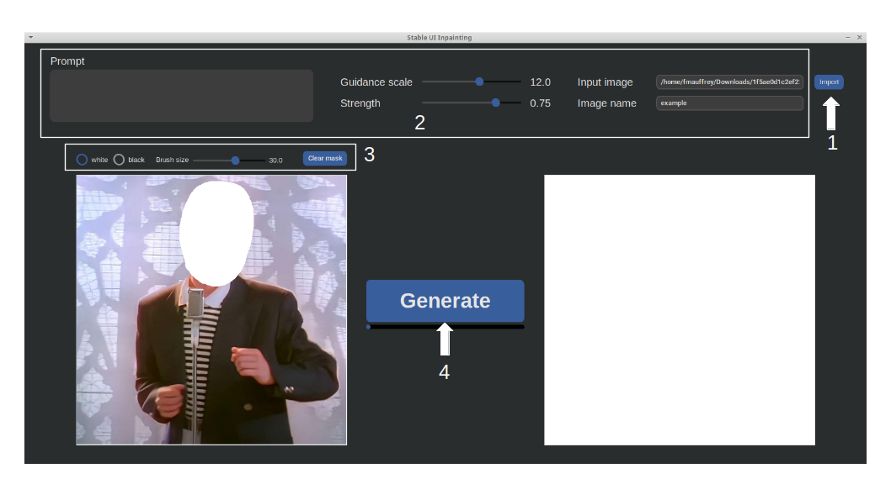

# StableDiffusion-UI

Interface for stable diffusion using DirectML (https://gist.github.com/averad/256c507baa3dcc9464203dc14610d674) 
made with tkinter. Two UI are available, for classic text to image generation and for inpainting.  
All images are saved in the "images" folder. All images are generated with a size of 512*512.

## Use

After installing Stable diffusion following @averad instructions, simply download the 2 scripts in the same folder.
Some dependencies are required (see below).

## Dependencies
Install the following dependencies in the same environment you created then execute:
```
pip install customtkinter==4.6.3
pip install numpy
```

## Main GUI

To start the GUI, activate the environment then run the gui.py script.
```
sd_env\scripts\activate
python gui.py
```

1. Select the desired scheduler. The UI will freeze until the model has been loaded.
2. Select the mode.
   1. Render = rendering the best image once you found an appropriate seed, prompt and parameters. You can also 
just use it to generate any image.
   2. Explore = quickly find the appropriate seed for a specific prompt. This mode will generate 4 images with different and 
random seeds and displays all the images with the corresponding seeds. You should use a low number of inference steps 
in this mode to quickly generate the 4 images and then use the best seed in render or variations mode.
   3. Variations = generate the same image with some variations and plot them in a grid. Use it after finding a good 
seed. Do not use random seed (-1) in this mode. For each category, separate the different values by ",". For the prompt 
and negative prompt category, use REPLACE in your text to designate the term to replace.
3. Select your parameters. All parameters might not be available for every mode.
4. Hit the generate button to start generating the image.  

#### Render example


#### Explore example
  

#### Variations example
  


## Inpainting GUI

To start the GUI, activate the environment then run the gui_inpainting.py script.
```
sd_env\scripts\activate
python gui_inpainting.py
```

1. Import you image. It will be resized to 512*512 automatically and displayed in the left canvas.
2. Choose the parameters for inpainting. The image will be saved in the /images/inpainting folder under the name given 
as output.
3. Paint on the image directly in the canvas. Inpainting will target only white areas. All pixel that are not pure white
will be converted into black to create the mask. To avoid inpainting in white areas of your image, you can also paint
in black.
4. Generate the new image with the given parameters. Once generated, it will be displayed in the right canvas.


